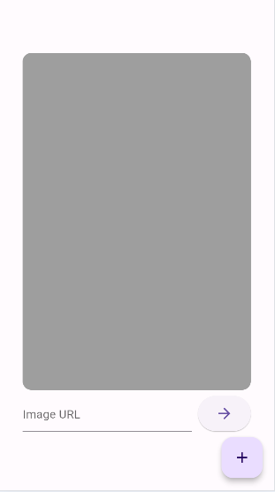
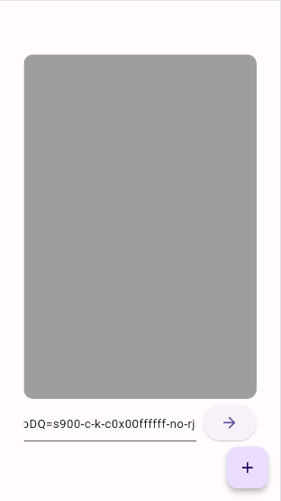

<h1>Enter Image URL </h1>
<table>
 
  <tr>
    <td></td>
    <td></td>
    <td></td>
  </tr>
 </table>
 <h1>Double Tap </h1>
<table>
  <tr>
    <td></td>
    <td></td>
  </tr>
 </table>
 <h1>Floating context buttons and testing actions</h1>
<table>

  <tr>
    <td></td>
    <td></td>
    <td></td>
    <td></td>
  </tr>
 </table>